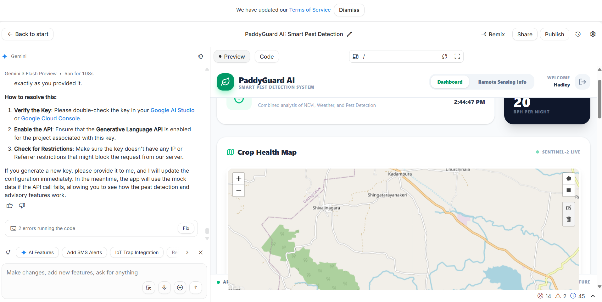
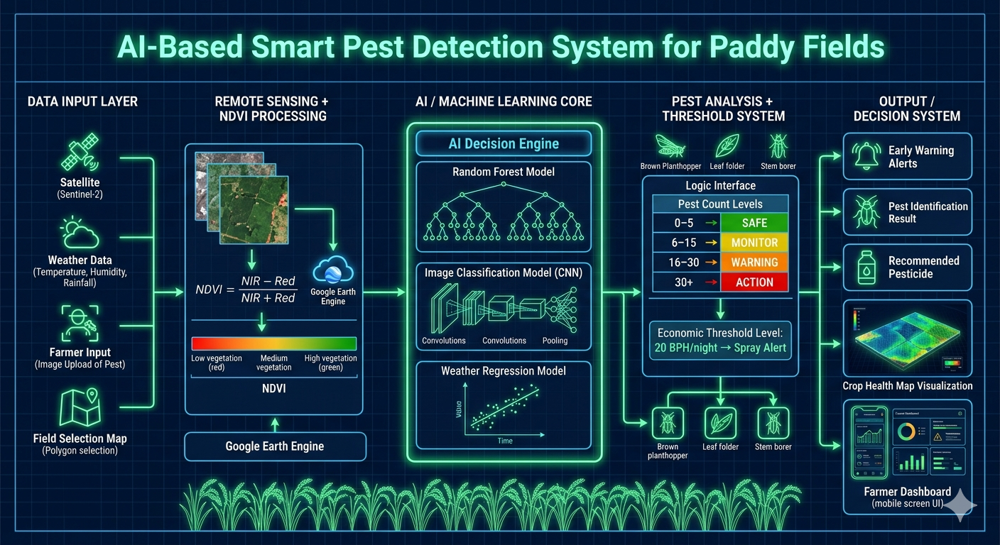

# 🌾 Smart AI Pest Early Warning System for Paddy Fields

---

## 🚨 Problem Statement

Paddy farmers often suffer major yield losses due to pest outbreaks such as **Brown Plant Hopper, Stem Borer, and Leaf Folder**.

The biggest challenge is:

* ❌ Pest detection usually happens **after visible damage**
* ❌ Farmers lack access to **real-time crop health insights**
* ❌ Weather conditions affecting pest growth are **not utilized effectively**
* ❌ Overuse of pesticides due to **lack of precise alerts**

👉 This leads to **economic loss, environmental damage, and reduced productivity**

---

## 💡 Project Description

We built an **AI-powered smart pest early warning system** that helps farmers detect, predict, and respond to pest threats **before severe damage occurs**.

### 🧠 Core Idea:

> Combine **Satellite Data + Weather Data + AI Models** to predict pest outbreaks early and guide farmer decisions.

---

### ⚙️ How It Works

#### 1. 🌿 NDVI Crop Health Monitoring

* Users select farm area on map (Leaflet Draw)

* System fetches **Sentinel-2 satellite imagery**

* Computes NDVI:

  NDVI = (B8 - B4) / (B8 + B4)

* Detects:

  * 🟢 Healthy zones
  * 🟡 Moderate stress
  * 🔴 High stress zones

👉 Identifies **where problems are starting**

---

#### 2. 🌦 Weather-Based Pest Prediction

* Inputs:

  * Temperature
  * Humidity
  * Rainfall

* Regression model predicts pest growth:

  log(BPH) = -23.289 + 0.741(Tmax) + 0.021(RF) + 0.051(RH²)

👉 Identifies **which pest is likely to occur**

---

#### 3. 🧠 AI Pest Detection (Image Classification)

* User uploads pest image

* CNN model classifies:

  * Brown Plant Hopper
  * Stem Borer
  * Leaf Folder

* Output:

  * Pest name
  * Confidence score
  * Recommended treatment

👉 Confirms **what pest is present**

---

#### 4. 🚨 Smart Alert System

Combines:

* NDVI stress zones
* Weather prediction
* Pest detection

Generates alerts:

* ✅ SAFE
* 👀 MONITOR
* ⚠️ WARNING
* 🚨 ACTION REQUIRED

Includes **Economic Threshold Level (ETL):**

> Trigger alert if ≥ 20 BPH per trap/night

---

#### 5. 🌱 Integrated Pest Management (IPM)

Provides:

* Targeted pesticide suggestions
* Biological control methods
* Avoids unnecessary spraying

---

## 🏆 What Makes This Project Unique

* 🔥 **Early Warning System (not just detection)**
* 🌍 Combines **Remote Sensing + AI + Weather Science**
* 📊 Multi-model intelligence (CNN + Random Forest + Regression)
* 🌾 Real-world farmer-centric solution
* ⚡ Decision-making focused (not just data visualization)

---

## 🤖 Google AI Usage

### Tools / Models Used

* Google Earth Engine (Sentinel-2 NDVI processing)
* Google Cloud (data processing & APIs)
* Gemini (for insights, explanations, and AI assistance)

---

### How Google AI Was Used

* 🌍 Google Earth Engine used to:

  * Fetch satellite imagery
  * Process NDVI data
  * Filter cloud-free images

* 🤖 Gemini used to:

  * Assist in system design
  * Generate insights and explanations for farmers
  * Improve UI explanations of remote sensing concepts

* ☁️ Google Cloud used for:

  * Backend deployment
  * Scalable API handling

---

## 📸 Proof of Google AI Usage

Screenshots available in `/proof` folder:



---

## 🖥 Screenshots




---

## 🎥 Demo Video

[Watch Demo](#)

---

## 🧱 Tech Stack

### Frontend

* React + Vite
* Leaflet + Leaflet Draw
* Tailwind CSS

### Backend

* FastAPI (Python)

### AI / ML

* CNN (Pest Detection)
* Random Forest (NDVI Classification)
* Regression Model (Weather-based Prediction)

### Data Sources

* Sentinel-2 Satellite Data
* Weather Data APIs

---
## 🎥 Demo & Live Access

### 🌐 Live Application
👉 [Open PaddyGuard AI](https://paddyguard-ai-smart-pest-detection-917344682390.us-west1.run.app)

### 🎥 Demo Video
👉 [Watch Demo](#)

## ⚙️ Installation Steps

```bash
# Clone the repository
git clone <your-repo-link>

# Go to project folder
cd project-name

# Install frontend dependencies
npm install

# Run frontend
npm run dev

# Backend setup
cd backend
pip install -r requirements.txt

# Run backend
uvicorn main:app --reload
```

---

## 🔮 Future Improvements

* 📈 Time-series NDVI analysis
* 📲 SMS alerts for farmers
* 🌐 Real-time IoT pest trap integration
* 🤖 More advanced deep learning models

---

## 👥 Team

* TEAM NAME: SPARK
LIYA S CHITTILAPPILY
CHANJAL CHANDRAN

---

## 💬 Final Note

> This project shifts agriculture from **reactive pest control → proactive pest prevention**, helping farmers act early, reduce losses, and farm smarter.

---
